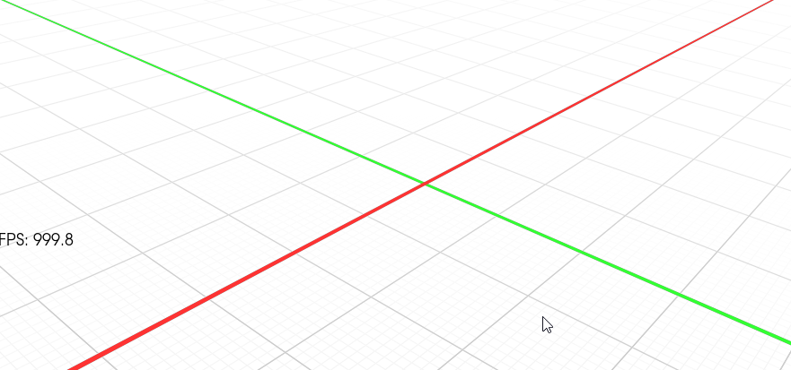

# vtkUtils

`vtkUtils` is a small collection of local VTK utility classes that can be built as an external VTK module without modifying the main VTK source tree.

The repository currently contains utility classes for rendering and interaction workflows, including:

* `vtkGridMapper` — an OpenGL-based mapper for rendering large or infinite grid planes with configurable spacing, colors, fading, axis colors, and solid-plane mode.
* `vtkTransformationWidget` — a custom 3D transformation widget with translation, rotation, axis handles, planar handles, helper lines, rotation overlays, and transform callbacks.

## Introduction

This repository demonstrates how to organize a local source repository where custom VTK classes can be compiled and wrapped into C++ and/or Python libraries without interfering with the main VTK source directory.

It is often useful to sort local VTK classes into different package directories, similar to how VTK itself is organized, for example:

* `Common`
* `Rendering`
* `Filtering`
* `Imaging`
* `IO`
* `Interaction`

This helps avoid dependency problems and gives a better overview of the class hierarchy.

The current repository uses the `Interaction` package directory for custom interaction and rendering utility classes.

If you do not care about this package-style ordering, classes can also be placed into a more general or unsorted directory. However, package-style organization is recommended when the number of local classes grows or when classes start depending on each other.

## Repository Layout

```text
vtkUtils/
├── CMakeLists.txt
├── README.md
└── Interaction/
    ├── CMakeLists.txt
    ├── Util.cxx
    ├── Util.h
    ├── vtk.module
    ├── vtkGridMapper.cxx
    ├── vtkGridMapper.h
    ├── vtkTransformationWidget.cxx
    └── vtkTransformationWidget.h
```

## Classes

### vtkGridMapper

`vtkGridMapper` is a custom `vtkOpenGLPolyDataMapper` implementation for rendering grid planes. It supports configurable grid spacing, fading distances, line widths, colors, axis colors, transparency, and solid-plane rendering.

Typical use cases include:

* CAD-like grid rendering
* 3D viewport reference planes
* Orthographic grid visualization
* Scene orientation helpers



### vtkTransformationWidget

`vtkTransformationWidget` is a custom `vtk3DWidget` for interactive 3D transformations.

It provides:

* X/Y/Z translation arrows
* XY/XZ/ZY planar translation handles
* X/Y/Z rotation handles
* Center-handle movement
* Rotation and translation overlays
* Transform getter/setter methods
* Custom transform-modified event propagation

This can be used as a viewport gizmo or transformation manipulator in VTK-based applications.

## Requirements

* CMake
* A working VTK build or VTK installation
* A C++ compiler supported by your VTK build
* Optional: Python wrapping support, depending on your VTK configuration

## Building

Create a separate build directory outside the source tree:

```bash
mkdir build
cd build
cmake ../vtkUtils
cmake --build .
```

On Windows with Visual Studio, you may also generate a Visual Studio solution:

```bat
mkdir build
cd build
cmake .. -G "Visual Studio 17 2022"
cmake --build . --config Release
```

Your VTK build or install directory should normally be found automatically if VTK is available through CMake.

If CMake cannot find VTK, pass the VTK directory manually:

```bash
cmake ../vtkUtils -DVTK_DIR=/path/to/vtk/build/or/install/lib/cmake/vtk
```

On Windows, this may look like:

```bat
cmake .. -DVTK_DIR=C:\path\to\VTK\lib\cmake\vtk
```

## Runtime Setup

After building, make sure the generated library directory is available at runtime.

On Windows, add the build output directory to `PATH`, for example:

```bat
set PATH=C:\path\to\vtkUtils\build\bin;%PATH%
```

On Linux/macOS, add the library output directory to `LD_LIBRARY_PATH` or `DYLD_LIBRARY_PATH` as appropriate:

```bash
export LD_LIBRARY_PATH=/path/to/vtkUtils/build/lib:$LD_LIBRARY_PATH
```

## Adding New Local VTK Classes

To add new classes:

1. Place the class header and source files in the appropriate package directory.
2. Update the package `CMakeLists.txt`.
3. Update `vtk.module` if the module dependencies change.
4. Use the module export macro in public classes.

For this repository, public classes should include:

```cpp
#include "vtkUtilsModule.h"
```

and use:

```cpp
class VTKUTILS_EXPORT vtkMyClass : public vtkObject
{
  // ...
};
```

Class names should start with `vtk`, otherwise VTK wrapping may fail.

## Package Organization

It is recommended to keep related classes together in package directories.

For example:

```text
Interaction/
Rendering/
Common/
IO/
```

This helps CMake and VTK resolve dependencies cleanly and keeps the repository easier to maintain.

## Distributing or Exchanging Modules

If you plan to exchange or distribute your modules, use a unique module/library prefix.

For example, instead of a generic prefix such as `vtkmy`, use something specific to your project or organization.

If renaming a prefix, make sure to update all related strings consistently:

* Replace the lowercase prefix, for example `vtkmy`, with your new prefix.
* Replace the uppercase prefix, for example `VTKMY`, with your new uppercase prefix.
* Update all export macros, for example `VTKMY_*_EXPORT`, to the new macro names.

The prefix should still allow class names to start with `vtk`, because VTK wrappers expect VTK-style class names.

Good examples:

```text
vtkUtils
vtkMyProject
vtkCompanyTools
```

Avoid names where the class itself does not start with `vtk`.

## GitHub Setup

After creating the GitHub repository, add it as the remote and push:

```bash
git remote add origin https://github.com/phuebner81/vtkUtils.git
git branch -M main
git push -u origin main
```

If the remote already exists, update it instead:

```bash
git remote set-url origin https://github.com/phuebner81/vtkUtils.git
git push -u origin main
```

